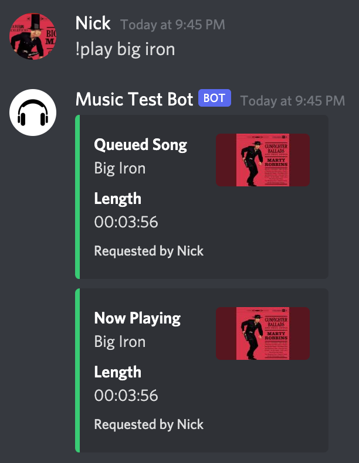
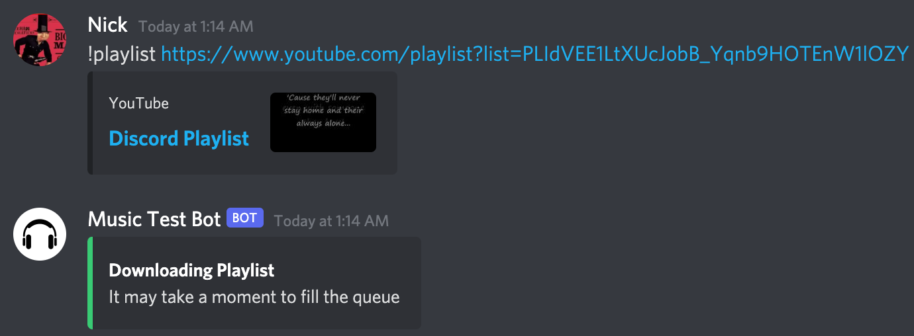
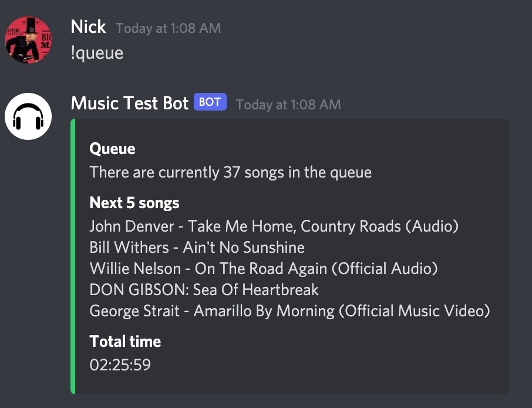
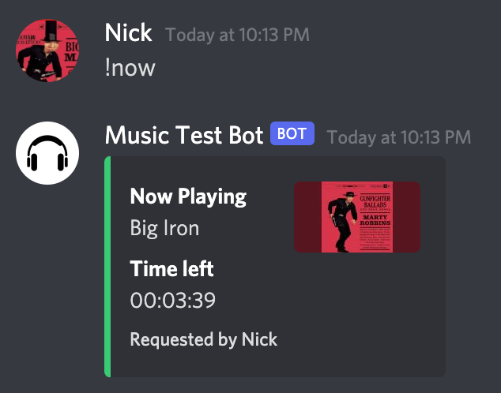
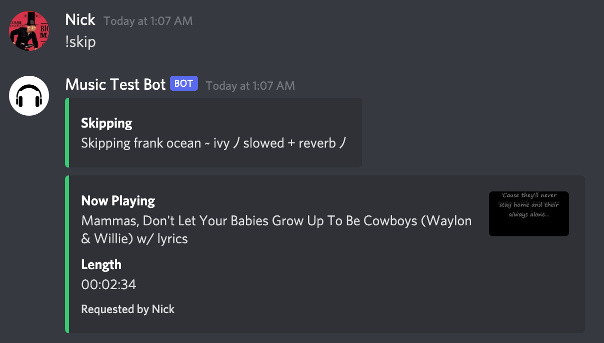
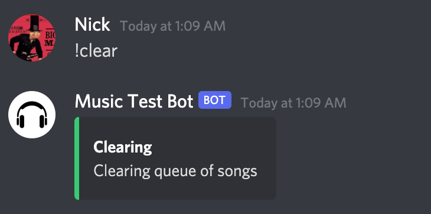
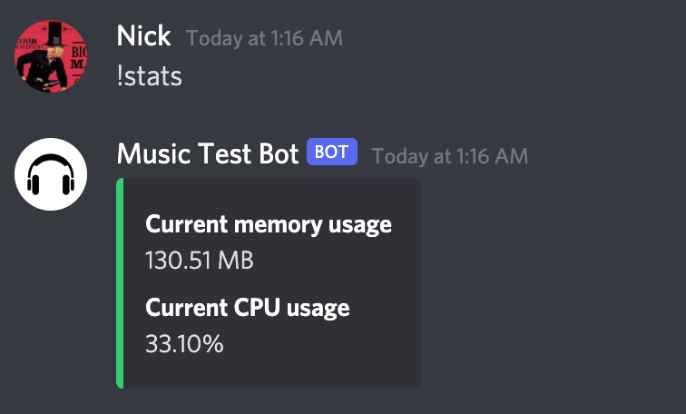

<h1 align="center">Nick's Discord Bot</h1>

## About
This Discord Bot can stream audio from YouTube to a Discord voice channel. Users can send commands such as `play`, `playlist`, `now`, `queue`, `skip`, or `clear` to interact with the bot.

## Built with
* [Discord.py](https://github.com/Rapptz/discord.py)
* [YouTube-dl](https://github.com/ytdl-org/youtube-dl)
* [PyTube](https://github.com/pytube/pytube)

## Getting Started
It is ideal to have this bot running on a 24/7 server. For example, I run mine of a Raspberry Pi 3 Model B+ with Ubuntu Server for Raspberry Pi.

1) Create a [Discord Bot Account](https://discordpy.readthedocs.io/en/stable/discord.html).

    The bot will need permissions to view channels, connect and speak in voice channels, send messages, embed links, and attach files. You can set these on your bot's developer portal, or use the permission integer `309240843264`.

2) Install the required libraries:
```sh
pip install -r requirements.txt`
```
3) Enter your bot's token in `config.py`:
```py
token = 'YOUR_TOKEN'
```
4) Invite the bot to your Discord server. Ensure your server's permissions allows the bot to You can generate the invite URL with the following URL (be sure to replace the client_id and permission integer with your client ID and permissions integer):
```sh
https://discord.com/api/oauth2/authorize?client_id={CLIENT_ID}&permissions={PERMISSION_INTEGER}&scope=bot%20applications.commands
```

5) Run the bot:
```sh
python bot.py
```

## How to Use

All commands have a `!` prefix before them. To see all commands, use `!help` in a Discord text channel.

### Available commands

#### Help
Displays commands the users can use, with examples.
* Example:

    ```sh
    !help
    ```

#### Play
Plays a YouTube audio file. Needs a search query or YouTube URL.
* Example:
    
    ```sh
    !play big iron
    ```
    ```sh
    !play https://www.youtube.com/watch?v=dQw4w9WgXcQ
    ```
    <p align="center">
        
    </p>

#### Playlist
Plays a YouTube playlist. Needs a YouTube playlist URL.
* Example:

    ```sh
    !playlist https://www.youtube.com/playlist?list=PLlW4ryhNwVgBfFH8C_cUIjauhQUnwYy-z
    ```
    <p align="center">
        
    </p>

#### Queue 
Displays how many songs are in the queue, the total time of queue, and the up next songs. By default up next shows a maximum of 5 songs, but it can be passed in a number to show more
* Example:

    ```sh
    !queue
    ```
    ```sh
    !queue 10
    ```
    <p align="center">
        
    </p>

#### Now
Displays the currently playing song, and how much time it has left.
* Example:

    ```sh
    !now
    ```
    <p align="center">
        
    </p>
#### Skip
Skips the currently playing song, and will play the next song in the queue.
* Example:

    ```sh
    !skip
    ```
    <p align="center">
        
    </p>

#### Clear
Clears the queue of songs and stops the currently playing song.
* Example:

    ```sh
    !clear
    ```
    <p align="center">
        
    </p>

#### Stats
For admin use. Displays the current memory usage of the bot, and the total CPU usage of the system.
* Example:

    ```sh
    !stats
    ```
    <p align="center">
        
    </p>